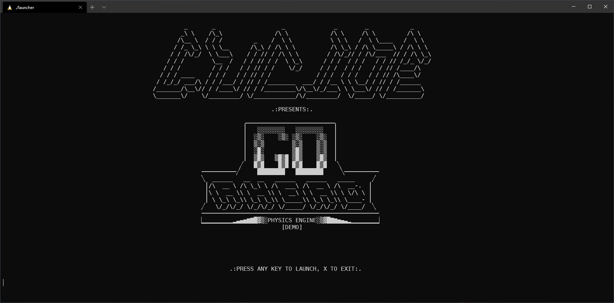

# Go Ahead

  

## What's this?

A tiny particle sandbox game written in C. It's a project I made when I was 16.

It was my second project based on **2D arrays**, I got inspired from a sandbox game for my Lumia. The graphics were made in GEdit, mostly by painfully editing the file line by line. Everything would then be converted to a single, long, literal string and placed in a `printf()` (as the `format` argument, ouch!).

The rules were as usual: do not use stuff we hadn't seen in class yet. That would've been cheating :).

## Features

* completely written in [Geany](https://www.geany.org/) on a Ubuntu VM
* screen still cleared with `system("clear")`, *ouch*!
* first project to use a launcher, as there's no asynchronous input. The launcher also warns the use to lower the terminal font size

  

## Curator

* UNIX project
* CMake scripts have been added
* launcher was edited to launch one executable only
